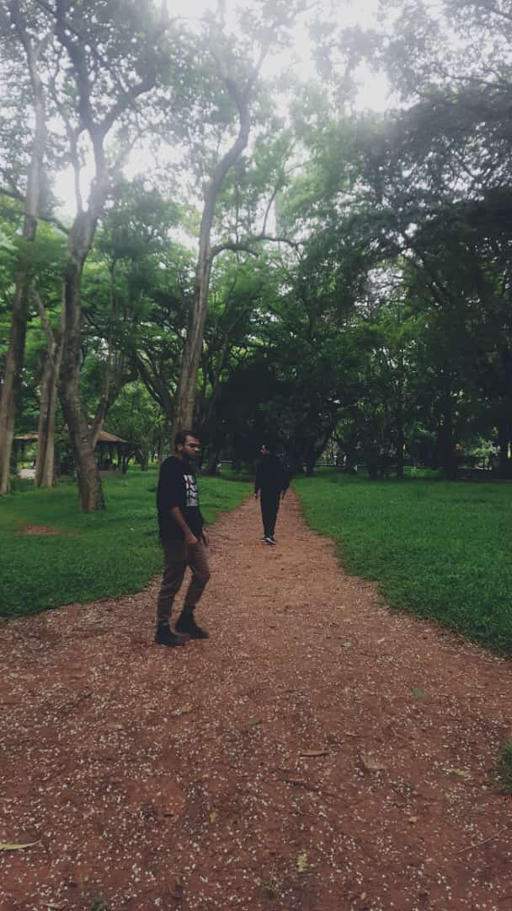

The first weekend in your first job hits different I think. It's Saturday and I'm sitting at the terrace of my PG, tired after a long day in Cubbon Park.

It was great, like a world safely hidden in another. A world that could be considered dangerous in a way, rife with snakes, spiders and plants that could harm.

_Ironically, this hidden, dangerous world felt safer than the one outside._

Within this dangerous world, there was a safe oasis where I sat and wrote for an hour or so. The attempt was to try and figure out why I felt the way I did after yesterday.

#### The conclusion, so far - my behaviour was not aligned with my soul.

I don't think I acted in a manner that would allow me to be content with myself. There was a tipping point in the night, before which I was in the present, happy to be with a friend. After the tipping point, I was no longer acting the way I wanted to, but the way I thought my friend wanted me to.

Maybe I need to realise that _I cannot afford to lose myself to keep others around_.

#### Maybe the ones who'd stay anyway are the ones you want to be around.

I need more clarity. I will probably write another one today, until then, see you.
